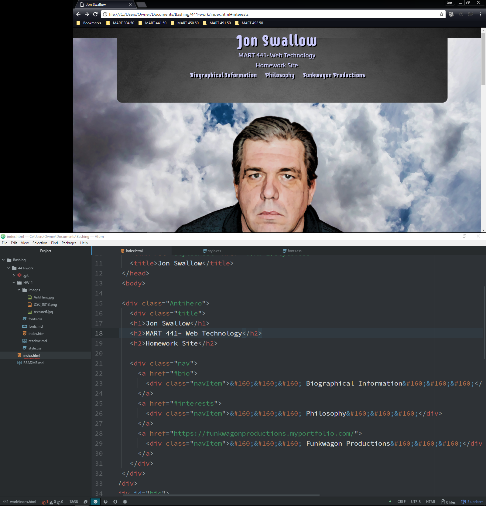

[Live Site](https://jonswallow.github.io/441-work/)

[Repository](https://github.com/JonSwallow/441-work/tree/master/HW-1)

## Homework 1
### Technical Report


## Overview
We were asked to create a webpage with the following requirements.
1. Parrellax Scrolling
2. Three Sections
3. Interpage linking
4. Responsive Web design, Mobile First


### Code
```
body {
  padding: 0;
  margin: 0;
  background-image: url("images/texture6.jpg");
  width: 100%;
  background-attachment: fixed;
  background-repeat: no-repeat;
  background-size: cover;
  background-position: center center;
  font-family: 'Ubuntu', sans-serif;
  font-weight: 300;
  text-shadow: 3px 3px rgb(0,0,0);

}
.inf-container {

  min-height: 50vh;
  font-size: 2em;
  dislay: flex;
  flex-wrap: wrap;
  justify-content: center;
}

.inf {
  margin: 25vh auto;
  padding: 0;
  text-align: center;
  width: 80%;
    font-family: 'Ubuntu', sans-serif;
    color: rgb(200,200,250);
    font-size: 20px;
    font-weight: normal;


}
.inf h1 {
font-family: 'Supermercado One', cursive;
color: rgb(200,200,250);
text-shadow: 3px 3px rgb(0,0,0);
}

```

----
###Results


### Problems
Well I hate to admit that I had to review a good bit from last semester to accomplish this.

I was trying to make it way harder than it had to be.

### Future work
I believe this was a great review. I feel ready to start creating Webpages on a regular basis. (Knock on wood concerning false bravado.)
### Community Spirit
I will always answer when someone calls.
Subscribed to the issues section on github and linked to my Gmail. If I do not know the answer I will try and find out. I think asking for help is my biggest problem.
"I am a man I can change... If I have to I guess... RedGreen"
### Conclusions
Took me a minute to get back into the fray. I look forward to a good semester. Cheers!!!
