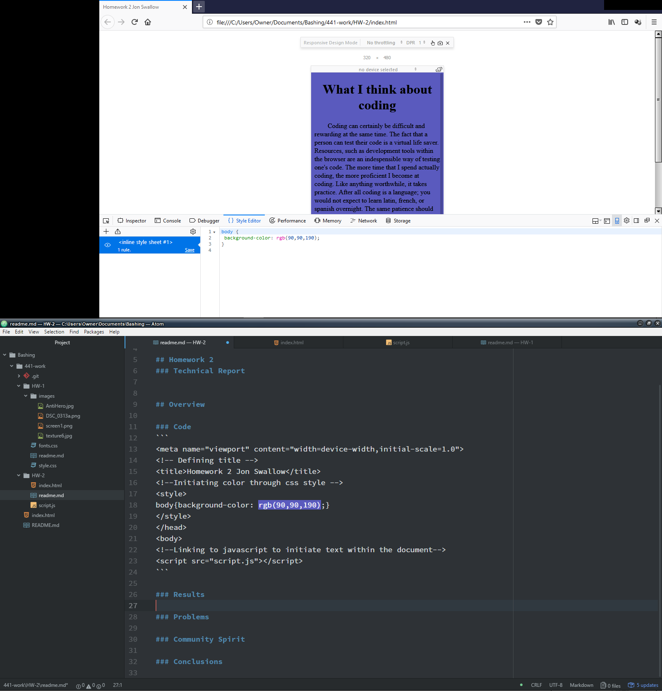

[Live Site](https://jonswallow.github.io/441-work/HW-2)

[Repository](https://github.com/JonSwallow/441-work/tree/master/HW-2)

## Homework 2
### Technical Report
## Overview
Things went smoothly this week. Luckily the foundation was built last semester making this a lighter week.
### Code
```
<meta name="viewport" content="width=device-width,initial-scale=1.0">
<!-- Defining title -->
<title>Homework 2 Jon Swallow</title>
<!--Initiating color through css style -->
<style>
body{background-color: rgb(90,90,190);}
</style>
</head>
<body>
<!--Linking to javascript to initiate text within the document-->
<script src="script.js"></script>
```

### Results

### Problems
Once in a while, I goof on linking a file.
### Community Spirit
I will continue to try and be of service to my fellow students.
### Conclusions
This was a light week. I am almost afraid that I am missing something. I do know that there will be weeks ahead that will be very challenging.I realize that we are still building foundations still, that we will use though out our web development careers.
