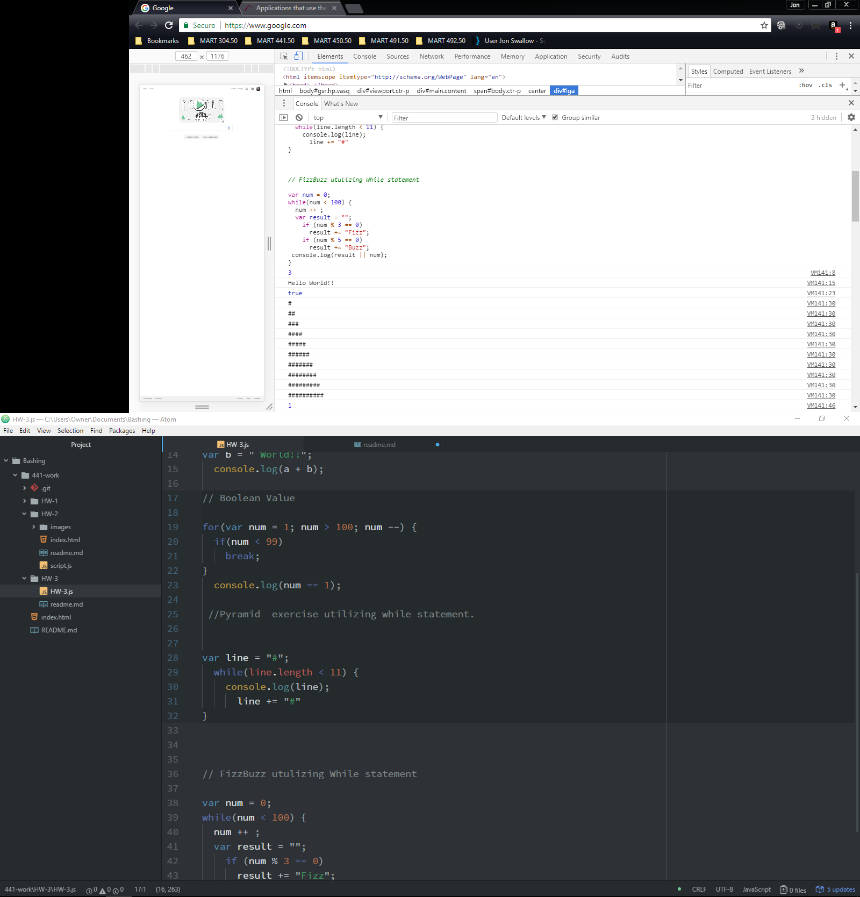

[Hw-3.js File](https://github.com/JonSwallow/441-work/tree/master/HW-3/HW-3.js)

## Homework 3
### Technical Report
## Overview
Although I took the creative coding course I found this to be a great deal of information this week.
I took it slowly over a few days reading the material and highlighting it in Kindle.
### Code
```
// Boolean Value

for(var num = 1; num > 100; num --) {
  if(num < 99)
    break;
}
  console.log(num == 1);

 //Pyramid  exercise utilizing while statement.


var line = "#";
  while(line.length < 11) {
    console.log(line);
      line += "#"
}

```

### Results

### Problems
I found the hints somewhat helpful but not as helpful as they could have been
### Community Spirit
I will continue to try and be of service to my fellow students.
### Conclusions
I will continue to try and build on my coding abilities thoroughout the semester. I am sure it will be worthwhile and rewarding in the end.
