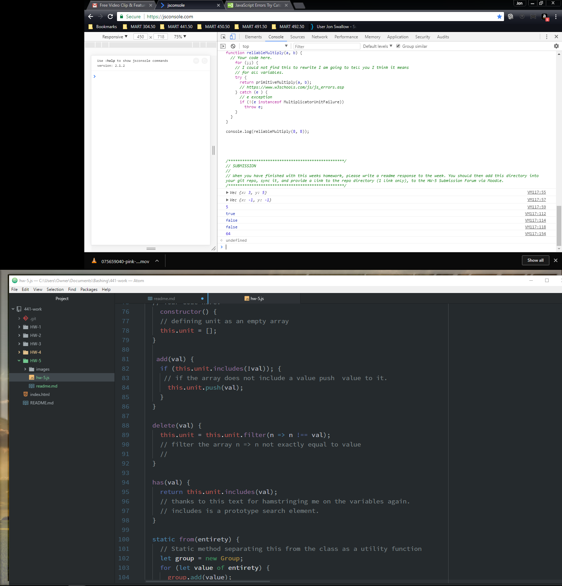

[Repository](https://github.com/JonSwallow/441-work/tree/master/HW-5)

Jon hates JavaScript
# Homework 5

### Technical Report

## Overview
I find the requirements of the exercises too restrictive for effective results. How can we learn to write code when it is so restrictive as to write itself in the requirements and the function calls?


### Code
```
if (this.unit.includes(!val)); {
 // if the array does not include a value push  value to it.
  this.unit.push(val);
}
}

delete(val) {
this.unit = this.unit.filter(n => n !== val);
// filter the array n => n not exactly equal to value
//
}

has(val) {
return this.unit.includes(val);
// thanks to this text for hamstringing me on the variables again.
// includes is a prototype search element.
```

### Problems
I think we covered those with utmost efficiency in the prior statements.

## Results

## Future work
It is quite easy to become discouraged.
### Comunity Spirit
I still try to help where I can
### Conclusions
I am here I will continue to do the best I can. I hope that the future weeks bring a more fundamental understanding because I feel like I may understand what this and that does and why. I am looking forward to traversing this watery terrain on a different tack.
