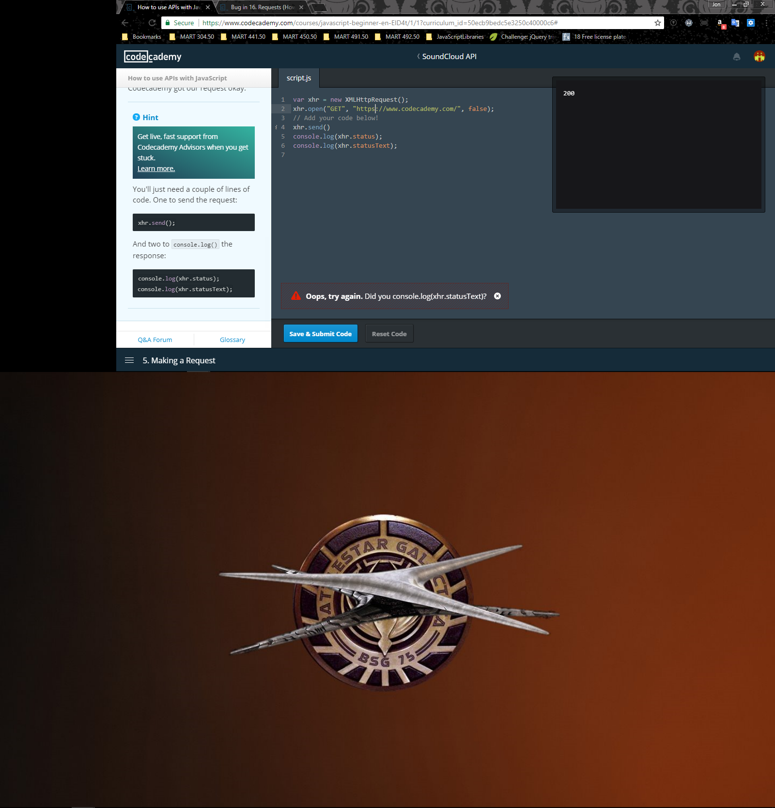
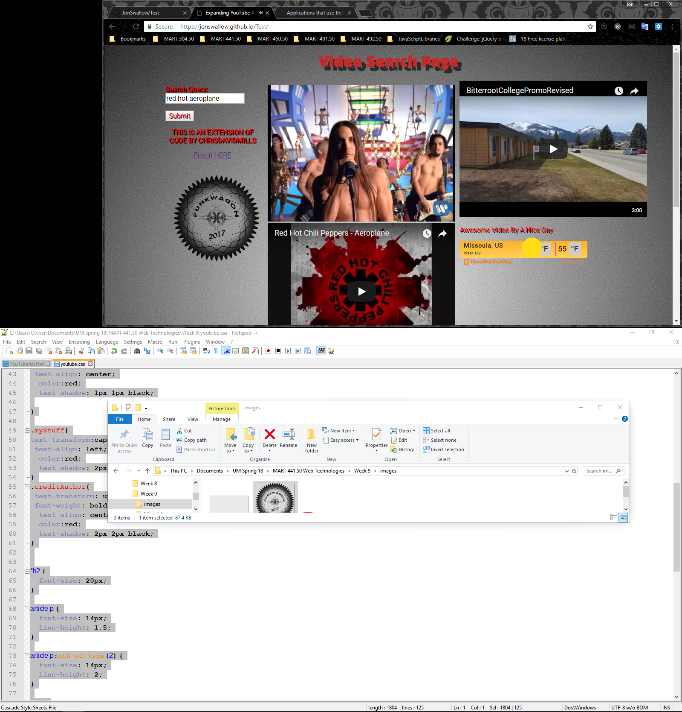

# Homework 7

[Live Site](https://jonswallow.github.io/441-work/HW-9)

[Repository](https://github.com/JonSwallow/441-work/tree/master/HW-9)

## Overview
This week the work was not difficult but I think the overwhelming amount of material was difficult to follow.


## Code
```
//sprucing up the page with jQuery
//hiding various elements
$(".headin").hide();
$("#openweathermap-widget-19").hide();
$(".youTube").hide();
$(".tubeYou").hide();
// function to pseudo animate the page
$(".youTube").slideDown(2000, function() {
$("#openweathermap-widget-19").fadeIn();
   $(".tubeYou").fadeIn();
$(".headin").slideDown(2000);
});
//creating elements with jQuery
var newP = $("<p>");
newP.addClass("creditAuthor");
newP.text("This is an expanding of code by chrisdavidmills ");
$(".controls").append(newP);
//creating a link to the source code
var link = $("<a/>");
link.addClass("linked");
link.attr('href',"https://github.com/mdn/learning-area/tree/master/javascript/apis/third-party-apis/youtube");
link.html("<center>Find it HERE</center><br><br>");
$(".controls").append(link);
//logo created by me
var newImg = $("",
     {id: "funkIt",
 src: "images/funkWa.png",
 })
// pseudo animating the logo
$(".controls").append(newImg);
$("#funkIt").hide();
$("#funkIt").fadeIn(9000);
```

## Problems
First off the same as source issue which I learned about quickly demanded me to upload to github and edit internally until I had some working code from there I went external and tested and retested then replaced what I had online.
There was an issue of some of the lessons being outdated but we got through it.


## Results
##### Example of issues encountered along the way.


##### Successful execution in browser


### Future work
Not so confident that I will ever call myself a developer.

### Comunity Spirit
Chelsea has the Discord room so it is in good hands. I still pop in and try and help.
I haven't seen anything on the forum for a long time.

### Conclusions
I sure the hell hope I did this assignment correctly if I did not I just do not know. So I credited the source code author as well. I understood it to be an expansion of existing code. I also recall the previous statement about ammending code with jQuery or JSON, I chose to use jQuery to ammend the code. 
